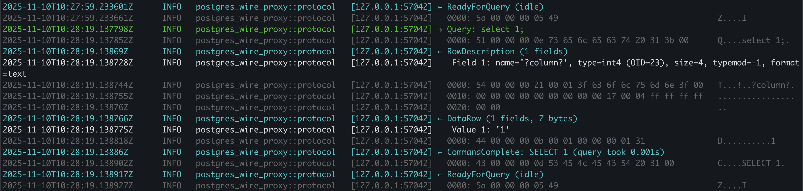
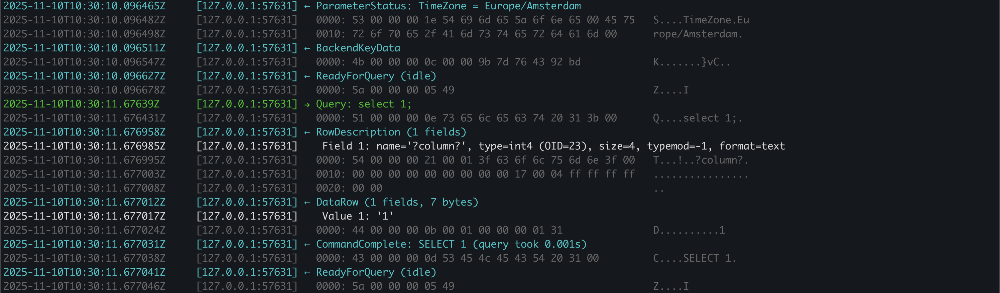
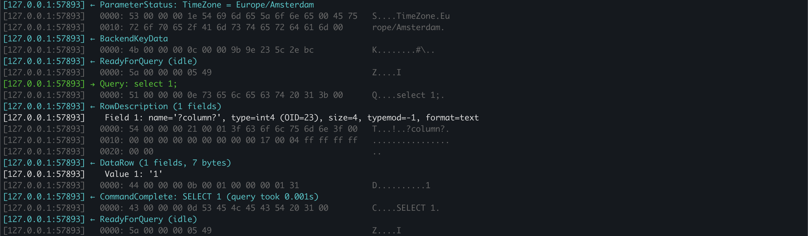
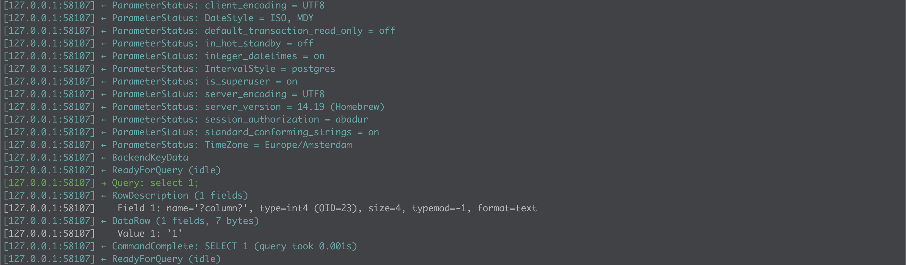

# Postgres Protocol Debug Tools

We have some complementary tools for inspecting and debugging PostgreSQL wire protocol traffic.

These are useful if you are building a postgresql wire compatible databases
- [postgres-wire-proxy](#postgres-wire-proxy): A transparent proxy that sits between a PostgreSQL client and server
- [pg-client-inspect](#pg-client-inspect): Inspect raw postgresql responses from client

## Protocol Debugging Proxy 

### postgres-wire-proxy

A transparent proxy that sits between a PostgreSQL client and server. It forwards traffic in both directions while decoding each wire protocol message, emitting readable logs and hex dumps. Use it to capture every step of the session, including authentication flow, prepared statements, copy operations, and TLS handshakes when configured.

Key capabilities:
- Bidirectional forwarding with minimal latency overhead
- Detailed protocol decoding for both client and server messages
- Optional TLS termination using `rustls`
- Flexible logging (stdout and/or file sinks) powered by `tracing`
- Configurable via CLI flags for listener address, upstream target, and logging settings

Run it with the standard Cargo command:

```bash
cargo run -p postgres-wire-proxy -- --help
```

You can point the upstream to your postgres compatible database and see the request responses in a human readable way.

```
[127.0.0.1:57985] → Parse (prepared statement, 34 bytes)
[127.0.0.1:57985]    Statement: '(unnamed)', Query: 'select * from tbl_decimal18_ts'
[127.0.0.1:57985]   0000: 50 00 00 00 26 00 73 65 6c 65 63 74 20 2a 20 66   P...&.select * f
[127.0.0.1:57985]   0010: 72 6f 6d 20 74 62 6c 5f 64 65 63 69 6d 61 6c 31   rom tbl_decimal1
[127.0.0.1:57985]   0020: 38 5f 74 73 00 00 00                              8_ts...
[127.0.0.1:57985] → Bind (10 bytes)
[127.0.0.1:57985]    Portal='(unnamed)', Statement='(unnamed)', Parameters=0
[127.0.0.1:57985]   0000: 42 00 00 00 0e 00 00 00 00 00 00 00 01 00 01      B..............
[127.0.0.1:57985] → Describe (portal, 2 bytes)
[127.0.0.1:57985]   0000: 44 00 00 00 06 50 00                              D....P.
[127.0.0.1:57985] → Execute (5 bytes)
[127.0.0.1:57985]   0000: 45 00 00 00 09 00 00 00 00 00                     E.........
[127.0.0.1:57985] → Sync
[127.0.0.1:57985]   0000: 53 00 00 00 04                                    S....
[127.0.0.1:57985] ← ParseComplete
[127.0.0.1:57985]   0000: 31 00 00 00 04                                    1....
[127.0.0.1:57985] ← BindComplete
[127.0.0.1:57985]   0000: 32 00 00 00 04                                    2....
[127.0.0.1:57985] ← RowDescription (2 fields)
[127.0.0.1:57985]    Field 1: name='ts', type=timestamptz (OID=1184), size=8, typemod=-1, format=binary
[127.0.0.1:57985]    Field 2: name='value_decimal', type=numeric (OID=1700), size=-1, typemod=1179658, format=binary
[127.0.0.1:57985]   0000: 54 00 00 00 3b 00 02 74 73 00 00 09 2a 9c 00 01   T...;..ts...*...
[127.0.0.1:57985]   0010: 00 00 04 a0 00 08 ff ff ff ff 00 01 76 61 6c 75   ............valu
[127.0.0.1:57985]   0020: 65 5f 64 65 63 69 6d 61 6c 00 00 09 2a 9c 00 02   e_decimal...*...
[127.0.0.1:57985]   0030: 00 00 06 a4 ff ff 00 12 00 0a 00 01               ............
[127.0.0.1:57985] ← DataRow (2 fields, 32 bytes)
[127.0.0.1:57985]    Value 1: <binary: 00 02 b0 d5 d4 e9 40 00>
[127.0.0.1:57985]    Value 2: <binary: 00 03 00 00 00 00 00 06 00 0a 04 d2 15 e0>
[127.0.0.1:57985]   0000: 44 00 00 00 24 00 02 00 00 00 08 00 02 b0 d5 d4   D...$...........
[127.0.0.1:57985]   0010: e9 40 00 00 00 00 0e 00 03 00 00 00 00 00 06 00   .@..............
[127.0.0.1:57985]   0020: 0a 04 d2 15 e0                                    .....
[127.0.0.1:57985] ← DataRow (2 fields, 32 bytes)
[127.0.0.1:57985]    Value 1: <binary: 00 02 b0 f4 6f a4 c7 40>
[127.0.0.1:57985]    Value 2: <binary: 00 03 00 00 00 00 00 06 00 c8 00 00 00 64>
[127.0.0.1:57985]   0000: 44 00 00 00 24 00 02 00 00 00 08 00 02 b0 f4 6f   D...$..........o
[127.0.0.1:57985]   0010: a4 c7 40 00 00 00 0e 00 03 00 00 00 00 00 06 00   ..@.............
[127.0.0.1:57985]   0020: c8 00 00 00 64                                    ....d
[127.0.0.1:57985] ← DataRow (2 fields, 28 bytes)
[127.0.0.1:57985]    Value 1: <binary: 00 02 b1 19 18 b1 69 00>
[127.0.0.1:57985]    Value 2: <binary: 00 01 ff ff 00 00 00 06 00 01>
[127.0.0.1:57985]   0000: 44 00 00 00 20 00 02 00 00 00 08 00 02 b1 19 18   D... ...........
[127.0.0.1:57985]   0010: b1 69 00 00 00 00 0a 00 01 ff ff 00 00 00 06 00   .i..............
[127.0.0.1:57985]   0020: 01                                                .
[127.0.0.1:57985] ← DataRow (2 fields, 32 bytes)
[127.0.0.1:57985]    Value 1: <binary: 00 02 b1 35 64 72 0b 80>
[127.0.0.1:57985]    Value 2: <binary: 00 03 00 00 00 00 00 06 27 0f 27 0f 26 ac>
[127.0.0.1:57985]   0000: 44 00 00 00 24 00 02 00 00 00 08 00 02 b1 35 64   D...$.........5d
[127.0.0.1:57985]   0010: 72 0b 80 00 00 00 0e 00 03 00 00 00 00 00 06 27   r..............'
[127.0.0.1:57985]   0020: 0f 27 0f 26 ac                                    .'.&.
[127.0.0.1:57985] ← CommandComplete: SELECT 4
[127.0.0.1:57985]   0000: 43 00 00 00 0d 53 45 4c 45 43 54 20 34 00         C....SELECT 4.
[127.0.0.1:57985] ← ReadyForQuery (idle)
[127.0.0.1:57985]   0000: 5a 00 00 00 05 49                                 Z....I
[127.0.0.1:57985] → Terminate
[127.0.0.1:57985]   0000: 58 00 00 00 
```


The default is outputting a full log (with timestamp, location, severity etc.)



In short format, we display timestamp and client and message. Use `--log-format short`



In bare format, we display client and message. Use `--log-format bare`



Also you might want to hide hex wire message. Use `--no-hex-dump`




## Protocol Debugging Client

### pg-client-inspect

Currently you can send a prepared statement and select n=binary/text mode.

We are planning to extend this to test arbitrary command sequences or pipelining. 

```
Inspect raw PostgreSQL protocol responses

Usage: pg-client-inspect [OPTIONS] --user <USER> --database <DATABASE> --query <QUERY>

Options:
      --host <HOST>                        [default: 127.0.0.1]
      --port <PORT>                        [default: 5432]
      --user <USER>
      --database <DATABASE>
      --query <QUERY>
      --password <PASSWORD>
      --binary-result <BINARY_RESULT>      [default: true] [possible values: true, false]
      --timeout-seconds <TIMEOUT_SECONDS>  [default: 10]
  -h, --help                               Print help
  -V, --version                            Print version
```

### Example:

```

$ cargo run -p pg-client-inspect -- --user=aybarsb --database=postgres --query="select 1;"
    Finished `dev` profile [unoptimized + debuginfo] target(s) in 0.13s
     Running `target/debug/pg-client-inspect --user=aybarsb --database=postgres '--query=select 1;'`
parameter: in_hot_standby = off
parameter: integer_datetimes = on
parameter: TimeZone = Europe/Amsterdam
parameter: IntervalStyle = postgres
parameter: is_superuser = on
parameter: application_name = postgres-protocol-inspector
parameter: default_transaction_read_only = off
parameter: scram_iterations = 4096
parameter: DateStyle = ISO, MDY
parameter: standard_conforming_strings = on
parameter: session_authorization = aybarsb
parameter: client_encoding = UTF8
parameter: server_version = 17.6 (Homebrew)
parameter: server_encoding = UTF8
backend key data: pid=78972 secret=-1068607409
ready for query (transaction state 73)
parse response: ParseComplete
bind response: BindComplete
row description arrived:
  col 0: name='?column?' oid=23 format=binary
data row received:
    col 0 (?column? / binary): text:''
parse complete: true
bind complete: true
row description (1 column(s)):
  0: name='?column?' oid=23 format=binary
row 0:
  0 (?column? / binary): text:''
command tag: SELECT 1
```

## Make Targets

- `make build-proxy` – compile the proxy
- `make build-inspector` – compile the inspector
- `make check` – run `cargo check --all`
- `make fmt` – format the workspace with `cargo fmt`
- `make clean` – remove the workspace `target/` directory

To run the commands you can use usual "cargo run"

```bash
cargo run -p postgres-wire-proxy -- --port=5555 --upstream-port=5432
cargo run -p pg-client-inspect -- --host=127.0.0.1 --user=myuser --query='SELECT 1'
```

Override the `CARGO` variable if you need a specific toolchain, e.g. `make proxy CARGO=~/.cargo/bin/cargo`.

## Getting Started

1. Install the latest stable Rust toolchain: <https://rustup.rs>
2. Clone this repository and change into the root directory.
3. Use `cargo run -p postgres-wire-proxy -- --help` to review proxy options.
4. For ad-hoc queries or protocol experiments, use `pg-client-inspect` via `cargo run -p pg-client-inspect -- --query='...' --user=...` to send a single command and observe the raw backend messages.

